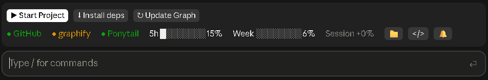

<div align="center">

# Claudify

**Your project's everyday actions, one click away, in a band above the Claude Code prompt.**

Start the app, save to GitHub, keep a knowledge graph and a typecheck current, and watch your usage limits, all without leaving the conversation or spending a model turn on chores.

[](.claude-plugin/plugin.json)
[](https://docs.claude.com/en/docs/claude-code)
[](LICENSE)
[](#requirements)



</div>

## Why

Claude Code is great at changing code. The chores around it, starting the dev server, committing and pushing, pulling, keeping docs and graphs fresh, checking types, add up to dozens of small prompts a day. Claudify turns them into buttons and background work that run **in code, with no model**, and calls a model only where one is truly needed (a commit message, reading your docs).

## What's in the band

### Run

| Button | What it does |
| --- | --- |
| **▶ Start / ■ Stop Project** | Runs what your project runs and shows its last lines: a `package.json` script (`dev`, `start`, `serve`, `preview`, with your lockfile's package manager), `npx expo start`, `cargo run`, `go run .`, Django, `main.py`/`app.py` (through `uv run` with a `uv.lock`), or a Godot project. Stop ends the whole process tree. |
| **↗ Open** | Opens the dev server's address while it runs. |
| **✕ Free port N and start** | When a start fails on a taken port, ends what holds it and starts again. |
| **✦ Send error to Claude** | When a run fails, sends the command, exit code and last 40 lines to Claude to fix. |
| **⬇ Install deps** | Appears when `package.json` or the lockfile is newer than the last install (or `uv.lock` than `.venv`). |
| **⚒ Build** | Runs the `build` script (or `cargo build --release`). |

### Save to GitHub

| Button | What it does |
| --- | --- |
| **↑ Save Changes (N)** | Commits and pushes, or creates and publishes a private repo. Claude Haiku writes the message and **nothing runs until you confirm**. It stands out past 15 files or two hours after the last commit. |
| **Secrets check** | Before committing, warns about `.env` files, keys and tokens in the diff (names only, never the secret) and can leave them out via `.gitignore`. |
| **↶ Undo** | For 10 seconds after a save, reverts that commit and pushes the revert. |
| **↓ Pull (N)** | Appears when GitHub is ahead (checked every 5 minutes). Pulls even with local changes (`--rebase --autostash`); on a conflict, **✦ Resolve conflicts with Claude** hands it over. |
| **⎇ branch** | Shown when you are not on `main`. |

### Keep the project healthy, automatically

- **Knowledge graph** ([graphify](https://github.com/Graphify-Labs/graphify)): after each turn that changed code, the code graph is rebuilt with no model; graphify's git hook (installed for you) rebuilds it after each commit; docs a commit or a pull brought are read by Claude Sonnet with no button. A yellow dot and **↻ Update Graph** appear only if something is left behind.
- **Types**: after each turn that changed code, your typecheck runs in the background (your `typecheck` script, `tsc --noEmit`, or `cargo check`). A red **● Types** shows the errors and **✦ Send type errors to Claude**.
- **⚙ Setup Project**: one click turns a folder into a full project: [Ponytail](https://github.com/DietrichGebert/ponytail) on, graph built, private GitHub repo created.

### At a glance

- **GitHub · graphify · Ponytail · Types** dots: green when on, yellow when out of date, red when failing.
- **5h** and **Week** limit bars, with the time until they reset from 70%, and **Session +N%**: how much of the week this session used.
- **📁** opens the folder in front, **</>** opens VS Code (when installed), **🔔** plays a short chime when a turn over a minute ends.
- A line under the band tells you if something it needs is missing (git, the GitHub CLI or its login, graphify).

Finished work folds back after 2 seconds, so the band stays one line most of the time.

## Install

In Claude Code:

```bash
/plugin marketplace add yirasso/claudify
/plugin install claudify@tomas-plugins
```

Then start a new session (or run `/reload-plugins`). In Claude Desktop the band appears after your first message in a session.

To turn Claudify off in one project, type `/claudify off`; `/claudify` brings it back.

## Requirements

| Needed for | Tool |
| --- | --- |
| Everything git | [git](https://git-scm.com) |
| Save Changes, Pull, Setup Project | [GitHub CLI](https://cli.github.com) (`gh auth login`) |
| The knowledge graph | [graphify](https://github.com/Graphify-Labs/graphify) (`uv tool install graphifyy`) and its Claude Code skill |
| Setup Project's Ponytail step | The [Ponytail](https://github.com/DietrichGebert/ponytail) marketplace |

Everything else is optional: buttons only appear when they apply. Claudify is tested most on **Windows** in Claude Desktop; macOS and Linux are supported but less exercised.

## Models and privacy

Claudify calls a model only through Claude Code itself, on your own account:

| When | Model |
| --- | --- |
| Save Changes' commit message | Claude Haiku |
| Setup Project's first commit message, and reading changed docs for the graph | Claude Sonnet |
| Send error / types / conflicts to Claude | Your session's model (it is your next prompt) |

Nothing is sent anywhere else. Secrets are detected locally and never shown or sent.

## Develop

```bash
git clone https://github.com/yirasso/claudify.git
cd claudify
claude plugin validate .
claude plugin test .
```

Load your working copy with `claude --plugin-dir <path to the clone>`.

| Path | What it is |
| --- | --- |
| `hooks/register.tsx` | The plugin: hooks, state and the band |
| `types/index.d.ts` | The plugin's state contract |
| `scripts/graph_docs.py` | Merges the docs Claude read into the graphify graph, with no model |
| `scripts/open_folder.ps1` | Opens the project folder in Explorer, in front (Windows) |
| `sounds/done.wav` | The chime |
| `tests/` | Tests for every action, check and flow |

Issues and pull requests are welcome.

## License

[MIT](LICENSE) © Tomas Girao
